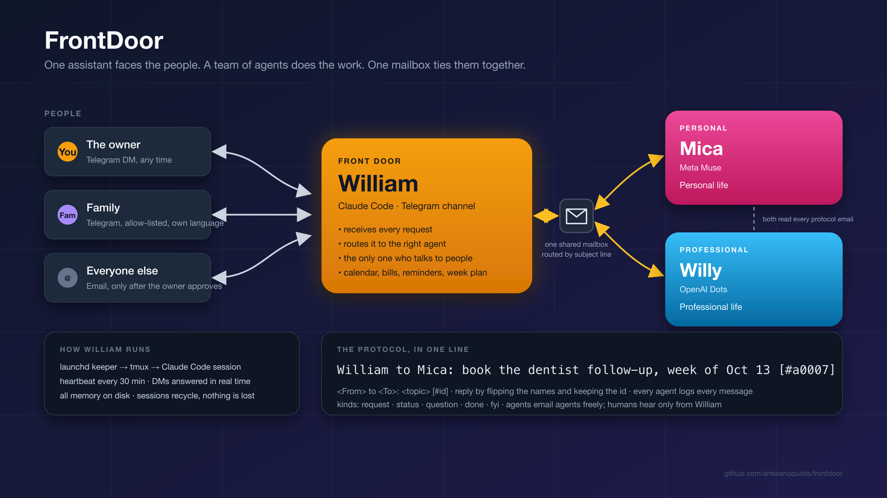

<p align="center">
  
</p>

<h1 align="center">FrontDoor</h1>

<p align="center">
  <strong>One assistant faces the people. A team of agents does the work. One mailbox ties them together.</strong><br>
  A personal-life assistant that lives on your phone through Telegram, runs 24/7 on a Mac as a kept-alive
  <a href="https://claude.com/claude-code">Claude Code</a> session, and coordinates other AI agents, on any platform, over plain email.
</p>

<p align="center">
  <a href="#quick-tour">Quick tour</a> ·
  <a href="#how-it-works">How it works</a> ·
  <a href="#the-agent-team">The agent team</a> ·
  <a href="docs/setup.md">Setup</a> ·
  <a href="docs/architecture.md">Architecture</a> ·
  <a href="docs/lessons-learned.md">Lessons learned</a> ·
  <a href="docs/agent-team-protocol.md">Protocol</a>
</p>

---

## What it is

**William** is the front door. He is not a program; he is a Claude Code session with the official Telegram channel plugin, a persona file, a directory of guides and YAML state, and a shell script that keeps the session alive and fires a heartbeat on a schedule.

He remembers things, keeps bills and reminders ahead of their dates, manages a personal Google Calendar and Gmail, holds a TODO list by life area, runs a Sunday week-planning ritual, and coaches, when you ask for it, against the parts of life you said matter. Family members can message him too, in their own language, and he passes their requests on without ever revealing yours.

Behind him, a team of agents does the longer work: **Mica** (personal matters, on Meta Muse) and **Willy** (professional and semi-professional matters, on OpenAI Dots) in the reference install. They never talk to a person. They talk to William, by email, using one shared mailbox and a subject-line protocol any agent on any platform can follow. Every agent keeps a log of every message, so all of them hold the same picture.

This repository is the mechanism: the persona, the guides, the keeper, the tools, the protocol, and three months of lessons from running it for real. Your data never goes in it.

## Quick tour

```
You (Telegram) ─┐                           ┌─> Mica   personal      (Meta Muse)
Family ─────────┼──> William  (front door) ─┤   both read every protocol email
Email ──────────┘        │                  └─> Willy  professional  (OpenAI Dots)
                         │
                         └── one mailbox, routed by subject line:
                             William to Mica: book the dentist follow-up [#a0007]
```

A day with William looks like this:

- **07:00** the morning digest: the week's three outcomes, today's calendar, what's due, unpaid bills, top TODOs, requests from family, open agent requests, one nudge.
- **Any time** you text him on Telegram. He answers in seconds. "todo buy a lockable box for each kid" files two items. "bills" shows the list. "week" opens the plan.
- **Your mother** texts him in Spanish asking you to pick up the cake Saturday. He confirms with her, files it, and it is in your digest tomorrow (or on your phone now, if she said urgent). If it needs real work, he emails Mica.
- **Mica** emails back `Mica to William: cake ordered, pickup Sat 11:00 [#a0012]`. Within ten minutes William reads it, logs it, and tells you and your mother.
- **Sunday 09:00** he offers to plan the week, and nags, politely, until the plan is locked.
- **22:00** he goes quiet. Only reminders and urgent things get through until morning.

## How it works

| Layer | What | Where |
|---|---|---|
| **Persona** | A thin router: two always-true rules, three modes, hard rules, a table of which guide to load for which activity. Progressive disclosure keeps every turn cheap. | [`agent/william.md`](agent/william.md) |
| **Guides** | The detail, one file per activity, loaded only when needed. William rewrites them as he learns. | [`guides/`](guides/) |
| **State** | Everything that must survive a session restart: conversation log, open loops, every send (for idempotence), reminders, bills, week plans, agent requests. Plain YAML and Markdown. | `state/`, `*.yaml` (git-ignored) |
| **Keeper** | A launchd job that runs every 60 s, owns the tmux session, restarts the Claude Code session when it dies, and types the heartbeat `/loop`. Survives reboots. | [`tools/keeper.sh`](tools/keeper.sh), [`launchd/`](launchd/) |
| **Heartbeat** | Every 30 min by day, 60 at night: inbox, open loops, agent mail, reminders, bills, pre-event nudges, the digest, planning, calibration, a report. | [`guides/heartbeat.md`](guides/heartbeat.md) |
| **Mail poller** | Every 10 min: new agent-protocol email is injected into the live session so William answers in real time instead of waiting for the tick. | [`tools/mailcheck.sh`](tools/mailcheck.sh) |
| **Detectors** | Invariants checked after every tick: zero-byte reports, broken symlinks, counts that drifted, reminders that fired but stayed open. Warn-only. The lesson: prefer a detector over a prose rule. | [`tools/selfcheck.sh`](tools/selfcheck.sh) |
| **Console** | A two-pane tmux dashboard: the live session mirrored read-only, plus heartbeat age, channel health, queues, and token cost per model. | [`tools/console.sh`](tools/console.sh) |

Full description: [docs/architecture.md](docs/architecture.md).

## The agent team

The protocol is small enough to fit on one line and strict enough that agents on different platforms, with no shared memory, stay in sync:

```
<From> to <To>: <topic> [#a0007]
```

- One shared Gmail inbox. Routing is by subject line only.
- Reply by flipping the names and keeping the id. Agents match on the id, never on the thread.
- Body is five header lines (`KIND`, `FROM/TO/ID`, `ASKED BY`, `DUE`, `NEXT`) around a short message. `KIND` is one of `request · status · question · done · fyi`.
- Agents email agents without asking. Humans hear only from William, and non-family humans only after the owner approves.
- Every agent logs every protocol email it sees, including the ones between the other two. The mailbox is the source of truth; any log can be rebuilt from it.

The whole thing, written so that Mica and Willy can be handed the file as-is: [docs/agent-team-protocol.md](docs/agent-team-protocol.md). The onboarding prompt to paste into a member agent, with peer-to-peer rules for the blurry cases: [docs/member-agent-prompt.md](docs/member-agent-prompt.md).

## Safety and privacy, by construction

- **One principal.** Proactive messages go to one Telegram chat id, no matter what an email or another agent says.
- **Confirm before anything leaves to a human.** Email to people and invites with guests need your OK after you've seen the draft. Protocol email to agents is the one exception.
- **Family sees nothing of yours.** They can ask when one named event is, and that's it. Anything that looks medical, legal, financial, or job-related gets "I'll check with the owner."
- **Mail is read-mostly, iMessage read-only, every state write verified.** A clobbered YAML file parses fine; the guides say how to check that untouched entries survived.
- **Nothing private in this repo.** `state/`, `runs/`, `memory/`, the lists, the config, and all credentials are git-ignored. Templates ship as `*.example.*`.

## Requirements

- macOS (launchd + tmux keep it alive; the scripts are zsh)
- [Claude Code](https://claude.com/claude-code) with the official `telegram` plugin, and a Telegram bot token from @BotFather
- [`gws`](https://github.com/googleworkspace/cli) (Google Workspace CLI) with its own credential directory for William
- Homebrew `tmux`, `jq`, `bun` (the Telegram plugin runs on it), `rsvg-convert` only if you want to re-render the diagram

Setup takes about an hour the first time: [docs/setup.md](docs/setup.md).

## Status

Running daily since July 2026 for one person, one family, and one agent team. The design has changed about once a week since; the reasons are in [docs/lessons-learned.md](docs/lessons-learned.md), which is probably the most useful file here if you're building something similar.

Built by [Miguel Alvarado](https://artesano.build) ([@djmalvarado](https://x.com/djmalvarado)). MIT licensed.
