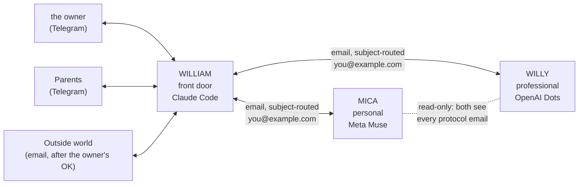

# The agent team: William, Mica, Willy (reference install — rename in config.yaml)

How three agents on three platforms work together for the owner, using one Gmail inbox
and one Telegram chat. Written 2026-10-05 for all three agents and for the owner. Names are the defaults from the reference install; rename freely in config.yaml. If you are Mica or
Willy, this is the whole protocol; you do not need anything else from William's files.

## 1. Who does what

| Agent | Platform | Role | Talks to |
|---|---|---|---|
| **William** | Claude Code, the owner's Mac | **Front door.** Receives everything from the outside world (the owner on Telegram, the owner's family on Telegram, email from people), decides who does the work, relays the result back. Also runs the owner's calendar, bills, reminders, week plan. | the owner and family on Telegram; Mica and Willy by email |
| **Mica** | Meta Muse | **Personal matters.** Family logistics, home, errands, kids' day-to-day, health appointments, personal reminders, anything the owner's family ask for. | William by email only |
| **Willy** | OpenAI Dots | **Professional and semi-professional matters.** Fundraising, PTO and school activities, a business or side project, job search, anything with an organization on the other end. | William by email only |

Mica and Willy never contact the owner, his family, or anyone else directly. When they have a
result or a question for a human, they email William, and William delivers it (Telegram to
The owner or family; email to others only after the owner approves). The owner can still open Muse or
Dots and talk to Mica or Willy himself; that is outside this protocol.

## 2. The shape



Plain-text version of the same picture:

```
   the owner (Telegram) ─┐                          ┌─> MICA  (Meta Muse)   personal
   Parents (Telegram) ─┼──> WILLIAM (front door) ─┤        both read every
   Outside email ──────┘        │                 └─> WILLY (OpenAI Dots) professional
                                │
                                └── one mailbox: you@example.com
                                    routing is by SUBJECT LINE only
```

## 3. The one rule that makes it work: the subject line

There is one mailbox, `you@example.com`, shared by the three agents. Every
agent-to-agent email has this exact subject shape:

```
<From> to <To>: <short topic> [#<id>]
```

Examples:

```
William to Mica: book the dentist follow-up, week of Oct 13 [#a0007]
Mica to William: dentist follow-up booked Tue Oct 14 15:30 [#a0007]
William to Willy: PTO fall fundraiser, volunteer slots for the owner [#a0008]
Willy to William: question, which Saturday is the owner free? [#a0008]
```

Rules:
- **Names are exactly** `William`, `Mica`, `Willy`. Capitalized, no "@", no platform names.
- **The id** is `#a` followed by four digits, assigned by whoever opens the thread (normally
  William). **Every message about that request keeps the same id**, in the subject, until the
  request is closed. Never reuse an id.
- **Reply by sending a new email with the flipped names and the same id.** Threading with
  "Re:" is fine but not required; agents match on `[#id]`, never on the thread.
- Search patterns each agent uses: `subject:"to William" ` / `subject:"to Mica"` /
  `subject:"to Willy"`, plus the id for a specific request. Keep the colon and spacing as shown.
- Anything in the mailbox **without** this subject shape is the owner's ordinary mail. Mica and
  Willy do not touch it. (William reads it as part of his normal job; a separate tool,
  maileman, labels it.)

## 4. Body format

Plain text, short, top to bottom:

```
KIND: request | status | question | done | fyi
FROM: William          TO: Mica          ID: #a0007
ASKED BY: the owner's father (Telegram, 2026-10-05 11:20 PT)    <- who originally asked, if anyone
DUE: 2026-10-10                                               <- optional

<what is needed, or what happened, in a few lines>

NEXT: <who does what next, one line>
```

- `request` opens work. `status` is progress. `question` needs an answer from the owner or the
  other agent; say exactly what is needed. `done` closes the id and includes the result.
  `fyi` needs no reply.
- Never put passwords, tokens, account numbers, or medical/legal detail in a body. Say where
  it is instead ("in the shared calendar event", "the owner has the form").
- Attachments are allowed. Links are better.

## 5. How a request flows

1. **Inbound.** the owner or a family member messages William on Telegram, or an email arrives for
   the owner that needs work. William decides: personal → Mica, professional → Willy. Unclear →
   William asks the owner once and remembers the answer as a routing rule.
2. **Dispatch.** William sends `William to <Agent>: … [#id]` with `KIND: request`, and logs it
   (see §7). He tells the asker "passed to Mica, I'll come back to you" if they are waiting.
3. **Work.** Mica or Willy does the work on their own platform. They may send `status` emails
   on long tasks and `question` emails when they need something only the owner can answer.
4. **Questions for the owner** go to William by email; William asks the owner on Telegram and emails
   the answer back under the same id. Agents do not wait silently: a `question` with no answer
   after 24 h gets one `status` nudge to William, then the work proceeds with the stated
   assumption or pauses, as the email says.
5. **Done.** The agent sends `done` with the result. William relays it to the person who asked
   (Telegram), and closes the id in his log. If the result has to go to an outside person by
   email, William drafts it and sends only after the owner approves.
6. **Nothing dies in silence.** William checks the mailbox **every 10 minutes** for subjects
   ending in `to William`. An open request with no `status`/`done` after its `DUE` (or after
   3 days if no DUE) gets a `status` request from William. Three unanswered nudges → William
   tells the owner the agent is unresponsive.

## 5b. Peer-to-peer: Mica and Willy may email each other

Many requests sit between personal and professional life. The agent William sent a request to
**owns** it, but may email the other agent directly, same subject shape, same id, to get the
piece it is missing or to hand the whole thing over:

```
Mica to Willy: what's the PTO contact for the fall event? [#a0012]     (KIND: question)
Willy to Mica: … [#a0012]                                                (KIND: fyi)
Mica to William: done … [#a0012]                                         (only the owner sends done)
```

- Helping is not taking over. Only the owning agent sends `done` to William.
- To transfer ownership, forward the request to the peer (`KIND: request`, same id, one line on
  why) and send William a `status` so he knows who to expect `done` from.
- A peer conversation with no existing id asks William for one first (`KIND: question`).
- William reads every protocol email, so he is always informed; nobody CCs him.
- Disagreement about ownership: whoever has it keeps it and asks William; William decides.

## 6. What goes back to the world

- **the owner** hears from William on Telegram: results, questions from the agents, and a line in
  the morning digest listing open agent requests (id, agent, topic, age).
- **Family** hears from William on Telegram, in their language, only about their own requests.
- **Anyone else** hears from William by email, only after the owner has seen the draft and said yes.
- Mica and Willy never message a human. If they could do it faster themselves, they still don't.

## 7. The shared log: everyone keeps the whole picture

Each agent keeps its own append-only log of **every protocol email in the mailbox, not just
its own** — sent or received by anyone, including the ones between the other two. One line per
email:

```
2026-10-05 11:24 PT | #a0007 | William -> Mica | request | dentist follow-up, week of Oct 13
2026-10-05 13:02 PT | #a0007 | Mica -> William | done    | booked Tue Oct 14 15:30
```

Why: sessions restart, platforms differ, and memory is not shared. The mailbox is the single
source of truth and the log is each agent's index into it. Any agent can rebuild its log at any
time by searching the mailbox for `subject:"[#a"`. If an agent's log and the mailbox disagree,
the mailbox wins.

Where each agent keeps it:
- William: `state/agent-mail-log.md` (this directory), plus `state/agent-requests.yaml` for the
  open/closed state of each id.
- Mica and Willy: wherever their platform keeps persistent notes, under the same line format,
  so a log line from any agent means the same thing.

## 8. Things that are always true

- One mailbox, subject-routed. No second address, no CC games, no forwarding to other inboxes.
- William is the only agent that talks to people. William is also the only one that assigns ids.
- An email without the subject shape is not for the agents.
- Agents send to each other without asking the owner. Anything to a human goes through William,
  and to a non-family human only with the owner's OK.
- the owner's private detail (money, health, custody, legal) travels in the fewest words possible,
  and never further than the agent that needs it to do the task.
- When in doubt, send a `question` email. A question costs ten minutes; a wrong assumption
  costs a day.

## 9. For William specifically (implementation notes, the others can skip)

- Config: `config.yaml:agents` (names, mailbox, subject pattern, 10-minute check).
- Guide: `guides/agents.md` is the rule read at the moment of dispatch and sweep.
- State: `state/agent-requests.yaml` (`requests:` list: id, to, topic, kind, asked_by, opened,
  due, status, last_update, closed) and `state/agent-mail-log.md` (append-only, §7 format).
- The 10-minute check is a small launchd job (`tools/mailcheck.sh`), not a faster heartbeat: it
  searches Gmail for new `to William` subjects and injects them into the live session the same
  way a Telegram message arrives, so William answers in real time instead of waiting for the
  30-minute tick. The tick still does the full sweep and the overdue nudges as a safety net.
- Sending protocol email needs no confirmation. Every other email send still does.
- Next free id: read it from `state/agent-requests.yaml`, never from memory.
